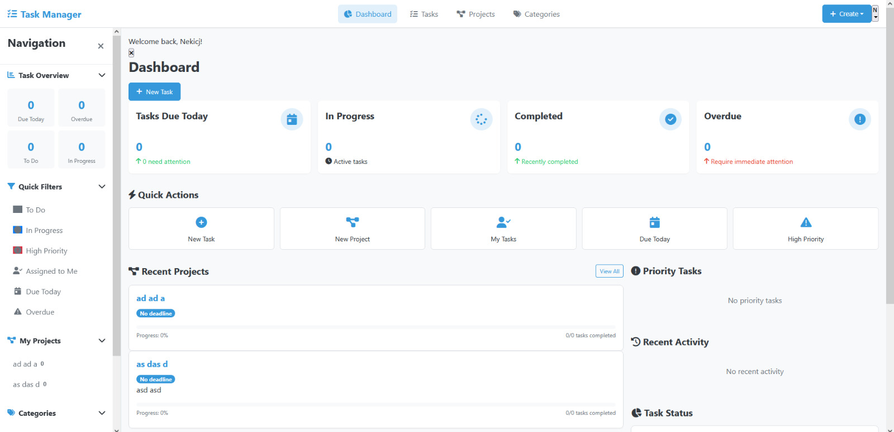

# Task Manager

A comprehensive Django-based task and project management system that helps teams track and collaborate on projects efficiently.

## Features

- **Project Management**: Create and manage multiple projects with team members
- **Task Tracking**: Track tasks with status, priority, and deadlines
- **Categorization**: Organize tasks with customizable categories
- **User Management**: User registration, authentication, and permissions
- **Comments & Attachments**: Add comments and file attachments to tasks
- **Dashboard**: Visual overview of tasks and projects
- **Data Backup & Restore**: Comprehensive backup and restore functionality

## Installation

### Prerequisites

- Python 3.8+
- Django 4.0+
- Database (SQLite, PostgreSQL, or MySQL)
- For backups with encryption: GPG
- For PostgreSQL backups: `pg_dump` and `psql` 
- For MySQL backups: `mysqldump` and `mysql`

### Setup

1. Clone the repository:
   ```bash
   git clone https://github.com/yourusername/task-manager.git
   cd task-manager
   ```

2. Create and activate a virtual environment:
   ```bash
   python -m venv venv
   # On Windows
   venv\Scripts\activate
   # On macOS/Linux
   source venv/bin/activate
   ```

3. Install dependencies:
   ```bash
   pip install -r requirements.txt
   ```

4. Set up environment variables (copy `.env.example` to `.env` and customize):
   ```bash
   cp .env.example .env
   # Edit .env file with your configurations
   ```

5. Run migrations:
   ```bash
   python manage.py migrate
   ```

6. Create a superuser:
   ```bash
   python manage.py createsuperuser
   ```

7. Start the development server:
   ```bash
   python manage.py runserver
   ```

8. Visit http://127.0.0.1:8000/ in your browser

## Backup & Restore System

The Task Manager includes a comprehensive backup and restore system to protect your data and enable easy migration between environments.

### Backup System Overview

The backup system provides:

- Database backups (SQLite, PostgreSQL, MySQL supported)
- Media files backup with directory structure preservation
- Fixtures backup for data portability
- Backup compression to save space
- Encryption for sensitive data protection
- Detailed backup manifests with checksums for integrity verification

### Backup Configuration Options

The backup system can be configured with several options:

- **Compression**: Toggle compression on/off and set compression level (1-9)
- **Component Selection**: Choose to backup database, media files, and fixtures
- **Encryption**: Optional GPG encryption for sensitive data protection
- **Custom Filename**: Specify custom backup filenames or use auto-generated timestamp-based names

### Using the Backup System

#### Through the Admin Interface

1. Log in to the admin interface at `/admin/` with superuser credentials
2. Navigate to the "Backup System" section
3. Fill out the backup form with your desired options
4. Click "Create Backup"

#### Via Management Command

```bash
# Basic backup with default options
python manage.py backup

# Backup with specific options
python manage.py backup --output-dir=/path/to/backups --filename=my_backup --compression-level=9

# Skip media files (database only)
python manage.py backup --skip-media

# Include fixtures
python manage.py backup --include-fixtures

# Encrypt the backup
python manage.py backup --encrypt
```

### Restore System Overview

The restore system provides:

- Database restoration from backups
- Media files restoration with multiple strategies
- Fixtures restoration for data import
- Support for encrypted backups
- Integrity verification before restoration

### Restore Configuration Options

- **Component Selection**: Choose to restore database, media files, and fixtures
- **Media Strategy**: 
  - Replace: Delete existing files and restore from backup
  - Merge: Keep existing files, add new ones from backup
  - Keep-Existing: Only restore files that don't exist yet
- **Integrity Check**: Validate backup integrity before restoration
- **Decryption**: Support for GPG-encrypted backups with passphrase

### Using the Restore System

#### Through the Admin Interface

1. Log in to the admin interface at `/admin/` with superuser credentials
2. Navigate to the "Restore System" section
3. Select a backup from the list
4. Choose restore options
5. Click "Start Restoration"

#### Via Management Command

```bash
# Basic restore with interactive confirmation
python manage.py restore /path/to/backup_file.tar.gz

# Force restore without confirmation
python manage.py restore /path/to/backup_file.tar.gz --force

# Restore only media files with merge strategy
python manage.py restore /path/to/backup_file.tar.gz --skip-database --media-strategy=merge

# Restore from encrypted backup
python manage.py restore /path/to/backup_file.tar.gz.gpg --passphrase=your_passphrase
```

### Troubleshooting Backup & Restore

#### Common Backup Issues

1. **Insufficient Disk Space**:
   - Free up disk space or specify a different output directory with `--output-dir`.

2. **Database Dump Fails**:
   - Ensure you have proper database permissions.
   - For PostgreSQL/MySQL, make sure the client tools are installed and in your PATH.

3. **GPG Encryption Fails**:
   - Ensure GPG is installed and available in your PATH.
   - Make sure the specified key is available in your GPG keyring.

#### Common Restore Issues

1. **Checksum Validation Fails**:
   - The backup may be corrupted; try using a different backup file.
   - Use `--no-backup-check` to skip validation (use with caution).

2. **Database Restore Fails**:
   - Check permissions on the database.
   - For PostgreSQL/MySQL, ensure the database exists and the user has appropriate permissions.

3. **Media Files Restore Fails**:
   - Check write permissions on the `MEDIA_ROOT` directory.
   - Ensure there's enough disk space available.

4. **Decryption Fails**:
   - Ensure you provided the correct passphrase.
   - Check if the GPG key used for encryption is available in your keyring.

## Best Practices for Backup

1. **Regular Backups**: Schedule regular backups using cron jobs (Linux/Mac) or Task Scheduler (Windows).
2. **Off-Site Storage**: Store backup files in a different physical location or cloud storage.
3. **Encryption**: Use encryption for backups containing sensitive user data.
4. **Verification**: Regularly test restoring from backups to ensure they're valid.
5. **Retention Policy**: Implement a policy for how long to keep backups.

## License

This project is licensed under the MIT License - see the LICENSE file for details.

## Acknowledgments

- Django project team
- Contributors and maintainers
